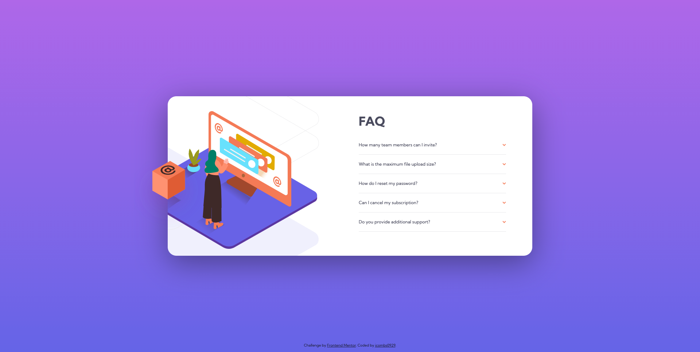

# Frontend Mentor - FAQ accordion card solution

This is a solution to the [FAQ accordion card challenge on Frontend Mentor](https://www.frontendmentor.io/challenges/faq-accordion-card-XlyjD0Oam). Frontend Mentor challenges help you improve your coding skills by building realistic projects.

## Table of contents

- [Overview](#overview)
  - [The challenge](#the-challenge)
  - [Screenshot](#screenshot)
  - [Links](#links)
- [My process](#my-process)
  - [Built with](#built-with)
  - [What I learned](#what-i-learned)
  - [Continued development](#continued-development)
- [Author](#author)

## Overview

### The challenge

Users should be able to:

- View the optimal layout for the component depending on their device's screen size
- See hover states for all interactive elements on the page
- Hide/Show the answer to a question when the question is clicked

### Screenshot



### Links

- Solution URL: [Add solution URL here](https://www.frontendmentor.io/solutions/faq-accordion-card-with-javascript-XSEzWTY7k)
- Live Site URL: [Add live site URL here](https://compassionate-kilby-05ea39.netlify.app/)

## My process

### Built with

- Semantic HTML5 markup
- CSS custom properties
- Flexbox
- CSS Grid
- Mobile-first workflow

### What I learned

I learned that some portions of a design may require more than 1-2 breakpoints to achieve proper responsiveness. I do believe there exists a more concise method of doing this, which I'm open to learning.

I was proud of the javascript I was able to write for this, and I feel like I'm grasping the concept of altering the DOM via javascript a lot better. Yay!

```js
function toggleFAQ(f) {
  let faqs = Array.from(document.getElementsByClassName("faq"));
  let filterFAQ = faqs.slice();
  filterFAQ.splice(f, 1);

  if (faqs[f].classList.contains("selected")) {
    faqs[f].classList.remove("selected");
  } else {
    faqs[f].classList.add("selected");
    filterFAQ.forEach((x) => {
      x.classList.remove("selected");
    });
  }
}
};
```

### Continued development

I believe the image portion of this exercize could be improved responsively.

## Author

- Website - [jeffcombsdesign.com](https://www.jeffcombsdesign.com)
- Frontend Mentor - [@jcombs0929](https://www.frontendmentor.io/profile/yourusername)
